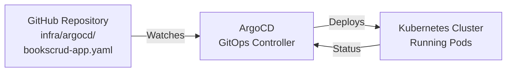

```markdown
# Deployment Architecture: Helm & ArgoCD

## ArgoCD GitOps Workflow



## Complete Deployment Architecture

```
┌─────────────────────────────────────────────────────┐
│              GitHub Repository                      │
│  ┌──────────────┐      ┌────────────────────────┐  │
│  │ bookscrud/   │      │ infra/argocd/          │  │
│  │ Chart.yaml   │      │ bookscrud-app.yaml     │  │
│  │ values.yaml  │      │ (Deployment manifest)  │  │
│  │ templates/   │      └────────────────────────┘  │
│  └──────────────┘                                   │
└──────────────┬──────────────────────────────────────┘
               │
        ┌──────┴──────┐
        │             │
        ↓             ↓
    ┌────────┐   ┌──────────┐
    │ Helm   │   │ ArgoCD   │
    │ Repo   │   │ App Repo │
    └────┬───┘   └────┬─────┘
         │            │
         └──────┬─────┘
                ↓
        ┌───────────────────┐
        │ Kubernetes Cluster│
        │                   │
        │ ┌───────────────┐ │
        │ │ Deployment    │ │
        │ │ - 2+ Replicas │ │
        │ │ - 8080 Port   │ │
        │ └───────────────┘ │
        │ ┌───────────────┐ │
        │ │ Service       │ │
        │ │ ClusterIP     │ │
        │ └───────────────┘ │
        │ ┌───────────────┐ │
        │ │ Ingress       │ │
        │ │ HTTP Routing  │ │
        │ └───────────────┘ │
        │ ┌───────────────┐ │
        │ │ HPA           │ │
        │ │ Auto-scaling  │ │
        │ └───────────────┘ │
        └───────────────────┘
```

## Helm Chart Components

| File | Purpose |
|------|---------|
| `Chart.yaml` | Chart metadata (name, version) |
| `values.yaml` | Default configuration values |
| `deployment.yaml` | Kubernetes Deployment spec with replicas, image, ports |
| `service.yaml` | Service for load balancing (port 80 → 8080) |
| `ingress.yaml` | HTTP routing and domain configuration |
| `hpa.yaml` | Horizontal Pod Autoscaler (min 2, max 10 replicas) |
| `serviceaccount.yaml` | RBAC identity for pods |
| `_helpers.tpl` | Template utility functions |

## ArgoCD Workflow

1. **Git as Source of Truth**
   - bookscrud-app.yaml defines desired state

2. **ArgoCD Monitoring**
   - Watches GitHub repository for changes
   - Polls every 3 minutes (configurable)
   - Detects configuration updates

3. **Automated Deployment**
   - Compares desired state (Git) vs actual state (Cluster)
   - Automatically syncs if diverged
   - Updates running pods

4. **Pod Orchestration**
   - Helm templates rendered with values
   - Kubernetes applies manifests
   - Pods created/updated/scaled

## Deployment Flow

```
Developer pushes code
    ↓
Container image built & pushed to registry
    ↓
Git commit updates infra/argocd/bookscrud-app.yaml
    ↓
ArgoCD detects change
    ↓
Helm chart values updated
    ↓
Kubernetes manifests generated
    ↓
Pods deployed/updated
    ↓
HPA monitors CPU usage
    ↓
Scales up/down as needed
```

## Key Infrastructure Features

- **Helm**: Template-driven Kubernetes deployments
- **ArgoCD**: Declarative GitOps continuous deployment
- **Kubernetes**: Container orchestration
- **Docker**: Containerized application (from Dockerfile)
- **HPA**: Automatic scaling based on load
- **Ingress**: External HTTP access with routing rules

