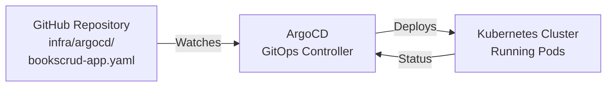

# BooksCRUD with ASP.NET Core, Helm, Redis, SQL Server and GitHub Actions

This project demonstrates a cloud-native deployment setup for an ASP.NET Core application using:

- ASP.NET Core web app
- SQL Server for persistence
- Redis for caching
- Helm charts for Kubernetes deployment
- Argo CD style GitOps flow
- GitHub Actions for secret-based deployment

## Architecture overview

- The web app is deployed through a Helm chart.
- SQL Server is deployed as a stateful workload with a PVC for persistence.
- Redis is deployed as a cache service.
- The app connects to SQL using the `sqlserver` service name and to Redis using the `redis` service name.

## ArgoCD GitOps workflow


```mermaid
graph LR
    Git["GitHub Repository<br/>infra/argocd/<br/>bookscrud-app.yaml"]
    ArgoCD["ArgoCD<br/>GitOps Controller"]
    Cluster["Kubernetes Cluster<br/>Running Pods"]

    Git -->|Watches| ArgoCD
    ArgoCD -->|Deploys| Cluster
    Cluster -->|Status| ArgoCD
```

## Secret-based deployment

The deployment workflow reads secrets from GitHub Actions secrets and injects them into the Helm release.

### Required GitHub secrets

- `SQL_PASSWORD`
- `REDIS_PASSWORD`

### Example deployment command

```bash
helm upgrade --install bookscrud ./bookscrud \
  --namespace default \
  --set secrets.sqlPassword=$SQL_PASSWORD \
  --set secrets.redisPassword=$REDIS_PASSWORD
```

## Local / kind notes

For local development with kind:

- SQL Server uses a PVC for persistence.
- Redis uses a simple Deployment and Service.
- The app expects service names `sqlserver` and `redis` inside the cluster.

## Key concepts demonstrated

- Kubernetes services and DNS
- Stateful workloads with PVCs
- Redis caching integration
- Helm-based deployment
- GitHub Actions secret injection
- GitOps-friendly deployment structure
